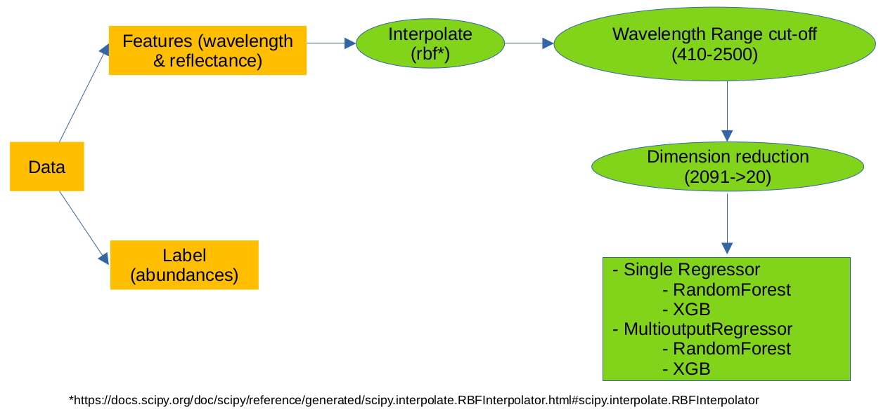

This is the reposotiry for the INAF usecase of Europlanet on Machine learning applied to spectral analysis for planetary minerals interpretation

[use case description](https://ml-portal.oeaw.ac.at/doku.php?id=science_cases:inaf_science_case)


```
|___docs
|______data_understanding.pdf
|___images
|___data_understanding.ipynb
|___ML.ipynb
|______requirements.txt
|___output
|______classification
|______regression
|___README.md

```
# Scripts
The main ML script is `ML.ipynb`. It reads in the data, does the preprocesing, trains the ML models and evaluates them.

# Data Overview
- There are 3 folders containing data
    - learning
    - slab
    - test
- Each sample is a json file which is composed of 
    - spectrum
        - wavelength
        - reflectance
        - error
    - grain_size
    - abundances 
    - Description
    - Version
- In total there are 683 samples in which 152 samples with labels (`abundances`) and 531 without labels.

    

    - There are 7 different classes
        - Basalt
        - Clinopyroxene
        - Glass
        - Olivine
        - Orthopyroxene
        - Plagioclase
        - graphite

- The number of samples which doesn't have consecutive wavelengths (and its `reflectance`) is depicted as the following chart.
    

- In numbers the table is re-written as below

    

- Since the missing ranges before 410 and after 2500 are dominated, in our machine learning task, the wavelengths in these ranges will be removed.

# Machine Learning
## Pipeline
- This is a multi-output classification or multi-output regression problem where the input is the obtained reflectance and the output is a composition of different mineral phase names. 
    - In regression task, the output is a list of real numbers ranging from 0 to 100 whose sum must be 100.
    - In classification task, the output is a list of binary values (0 or 1) which indicates that phase name exists (1) or not (0)

        

## Data Preparation
- Features: `reflectance`
    - Not only wavelength ranges are missing, single values of wavelength are also not available for all samples. To fill these gaps for reflectance values, an interpolation method is applied. Here we're using rbf interpolator (https://docs.scipy.org/doc/scipy/reference/generated/scipy.interpolate.RBFInterpolator.html#scipy.interpolate.RBFInterpolator)

- Labels: abundances
    - For Regression task: all values are kept the same
    - For Classification task: the non-zero values are treated as 1 and 0 otherwise

- Wavelength Cut-Off: due to the missing wavelengths mentioned above, the range of 410 to 2500 is used for input.
- Dimension Reduction: there are 2091 features (values) for each samples. To simplify this but still to make sure data is not lost so much, `Principal Component Analysis (PCA)` is used to reduce the number of features from 2091 to 20, for both training and test sets.

## Algorithm Evaluation
- The training set is split into 2 sets: learning and evaluation. The learning set is input into the algorithm and the evaluation set is used to evaluation and optimize the algorithm.
- In our use case, 20% (28 samples) of the training data (139 samples - json files) is separated for evaluation purpose.

## Results
### Evaluation - Classification
#### Random Forest (single Classifier)


- Only 6 samples are predicted wrong and only one class is wrong within 7 in total in each sample
- This classifier achieved almost 80% in accuracy

#### Multi-output Random Forest

- Multioutput random forest classifier has more errors than the single one but it does well in prediction of the minor class `Basalt` (sample 22 in the table)
- With 7 wrong prediction, this multi-output classifier brought the accuracy of 75%

### Evaluation - Regression
#### Radom Forest Regression


### Test set
- `result_cl_test_multirf.csv`: classification for test set using multi-output random forest
- `result_cl_test_rf.csv`: classification for test set using normal random forest
- `result_regr_test_rf.csv`: regression for test set using random forest
- `result_regr_test_rf.zip`: combine of result and original data

# Dependency Installation
- To run the notebooks, install `requirements.txt` into the python environment using `pip`
    ```
    pip install -r requirements.txt
    ```

### Acknowledgement


Europlanet 2024 RI has received funding from the European Union’s Horizon 2020 research and innovation programme under grant agreement No 871149.

<br clear="left"/>